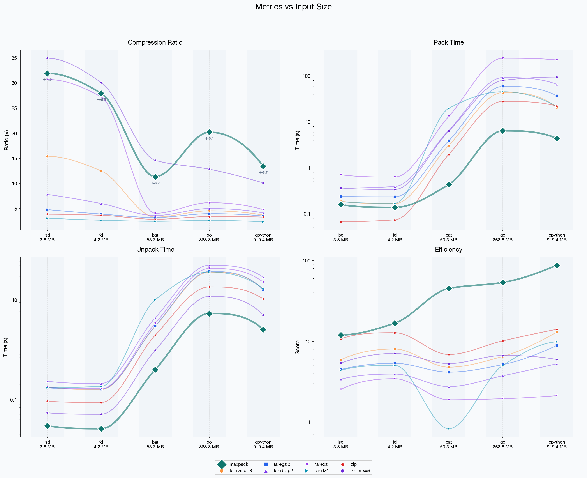

# maxpack

**Deduplicating archiver for versioned data.**

maxpack is a proprietary binary archiver built for corpora where files or releases overlap heavily: tagged source trees, CI artifacts, backups, logs, database dumps, and similar versioned datasets. It deduplicates identical chunks, keeps similar chunks adjacent, and then runs a solid compression pass over the result.

## Public Benchmark Snapshot

This README uses one canonical public benchmark protocol:

- `maxpack pack --mode fast --global-zstd-level 3`
- Apple Silicon/macOS benchmark machine
- versioned corpora with strong inter-version overlap

| Dataset | Input | maxpack | tar+zstd -3 | 7z -mx=9 | maxpack ratio |
|---------|------:|--------:|------------:|---------:|--------------:|
| `cpython_312` | 817 MB | **31.0 MB** | 215.2 MB | 64.4 MB | **26.4x** |
| `go_123` | 975 MB | **31.0 MB** | 210.1 MB | 70.7 MB | **31.4x** |

On these focused versioned-corpus benchmarks, maxpack produces archives about `6.8x-6.9x` smaller than `tar+zstd -3` and about `2.1x-2.3x` smaller than `7z -mx=9`.

More public plots and methodology notes: [docs/index.html](docs/index.html)

A simple public smoke helper for repeating the same `pack --mode fast --global-zstd-level 3` maxpack flow on your own datasets lives in [benchmarks/smoke_pack.py](benchmarks/smoke_pack.py).

The headline CPython/Go benchmark numbers were measured with `MAXPACK_THREADS=4` for maxpack, so they are not single-core figures.



## Install

### Quick install

macOS and Linux:

```bash
curl -fsSL https://raw.githubusercontent.com/MaxPer2005/maxpack/main/install.sh | sh
```

Windows x86_64:

```powershell
powershell -ExecutionPolicy Bypass -Command "irm https://raw.githubusercontent.com/MaxPer2005/maxpack/main/install.ps1 | iex"
```

### Supported CLI binaries in the current release

| Platform | Asset |
|----------|-------|
| macOS (Apple Silicon) | `maxpack-darwin-arm64` |
| macOS (Intel) | `maxpack-darwin-amd64` |
| Linux x86_64 | `maxpack-linux-amd64` |
| Linux arm64 | `maxpack-linux-arm64` |
| Windows x86_64 | `maxpack-windows-amd64.exe` |

### FFI assets in the current release

| Platform | Asset |
|----------|-------|
| macOS (Apple Silicon) | `libmaxpack-darwin-arm64.dylib` |
| macOS (Intel) | `libmaxpack-darwin-amd64.dylib` |
| Linux x86_64 | `libmaxpack-linux-amd64.so` |
| Linux arm64 | `libmaxpack-linux-arm64.so` |
| Windows x86_64 | `maxpack-windows-amd64.dll` |

The release also ships `maxpack.h` for C-compatible embedding.

## Verify Downloads

Each release publishes a `SHA256SUMS.txt` file alongside the binaries.

```bash
curl -fsSLO https://github.com/MaxPer2005/maxpack/releases/latest/download/SHA256SUMS.txt
shasum -a 256 maxpack-darwin-arm64
```

Match the printed digest against the corresponding line in `SHA256SUMS.txt`.

On Windows:

```powershell
Get-FileHash .\maxpack-windows-amd64.exe -Algorithm SHA256
```

## Quick Start

```bash
maxpack pack ./v1 ./v2 ./v3 --output project.maxpack
maxpack unpack project.maxpack --output ./restored
maxpack info project.maxpack
```

On first run, the CLI asks you to accept the EULA. You can also accept it non-interactively:

```bash
maxpack --accept-license pack ./data --output data.maxpack
```

## License

maxpack is proprietary software.

- Free for personal, non-commercial use up to **25 GB per archive**
- Unpacking existing archives is always free
- Commercial use requires a separate license

Contact: wundel.max@gmail.com

Full terms: [LICENSE.md](LICENSE.md)
