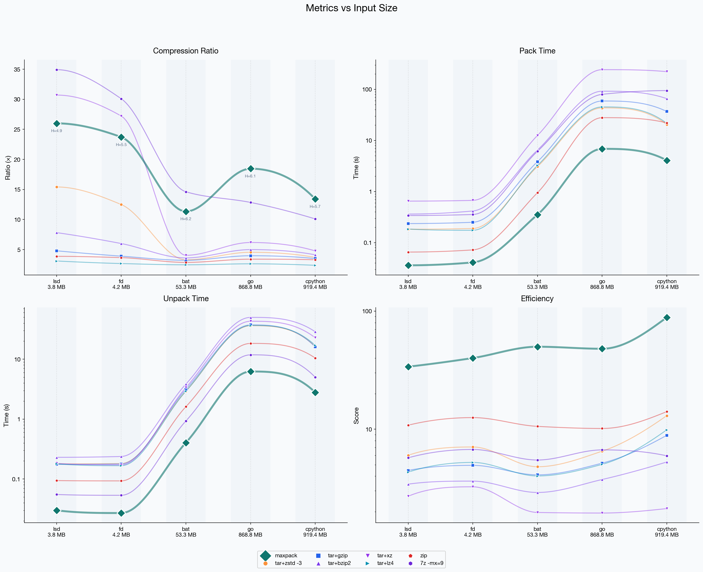

# maxpack

**Deduplicating archiver for versioned data.**

Packs multiple versions of a project into a single archive, achieving 5-20x better compression than tar+zstd by eliminating inter-version redundancy. Uses a proprietary deduplication and compression pipeline optimized for versioned data.

## Benchmarks

Compression ratio (higher = better) on real-world versioned datasets:

| Dataset | Input Size | maxpack | tar+zstd | 7z -mx=9 | tar+xz | tar+lz4 | zip |
|---------|-----------|---------|----------|----------|--------|---------|-----|
| lsd | 4 MB | **26.0x** | 15.4x | 34.9x | 30.7x | 3.1x | 3.9x |
| fd | 4 MB | **23.7x** | 12.5x | 30.1x | 27.2x | 2.7x | 3.7x |
| bat | 56 MB | **11.3x** | 3.3x | 14.6x | 4.0x | 2.5x | 2.9x |
| go | 911 MB | **18.5x** | 4.5x | 12.8x | 6.2x | 2.6x | 3.4x |
| cpython | 964 MB | **13.4x** | 3.7x | 10.1x | 4.8x | 2.4x | 3.3x |

On large datasets (>100 MB), maxpack dominates both ratio and speed:

| 900 MB dataset | maxpack | 7z -mx=9 | tar+xz |
|----------------|---------|----------|--------|
| **Ratio** | **18.5x** | 12.8x | 6.2x |
| **Pack time** | **2.2s** | 79.8s | 242.7s |
| **Pack speed** | **395 MB/s** | 10.9 MB/s | 3.6 MB/s |



## Install

### Quick install (macOS & Linux)

```bash
curl -fsSL https://raw.githubusercontent.com/MaxPer2005/maxpack/main/install.sh | sh
```

### Manual download

Download the binary for your platform from [Releases](https://github.com/MaxPer2005/maxpack/releases/latest):

| Platform | Binary |
|----------|--------|
| macOS (Apple Silicon) | `maxpack-darwin-arm64` |
| Linux x86_64 | `maxpack-linux-amd64` |
| Linux ARM64 | `maxpack-linux-arm64` |

```bash
chmod +x maxpack-*
sudo mv maxpack-* /usr/local/bin/maxpack
```

## Quick Start

**Pack** multiple versions of a project:

```bash
maxpack pack --output project.maxpack ./v1.0 ./v1.1 ./v1.2
```

**Unpack** an archive:

```bash
maxpack unpack project.maxpack --output ./restored
```

**Inspect** archive contents:

```bash
maxpack info project.maxpack
```

On first run, you'll be asked to accept the license agreement. You can also accept non-interactively:

```bash
maxpack --accept-license pack --output project.maxpack ./data
```

## License

maxpack is proprietary software. Free for personal, non-commercial use up to 50 GB cumulative input data. Unpacking is always free regardless of volume.

Commercial use requires a separate license. Contact: wundel.max@gmail.com

See [LICENSE.md](LICENSE.md) for the full End-User License Agreement.
